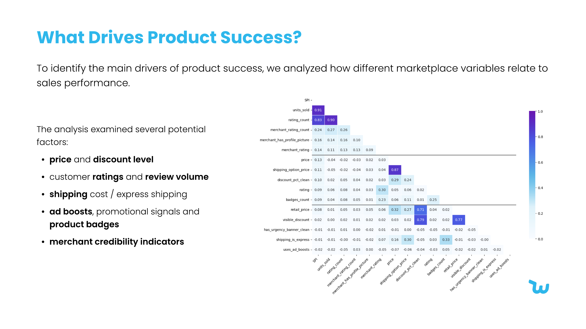
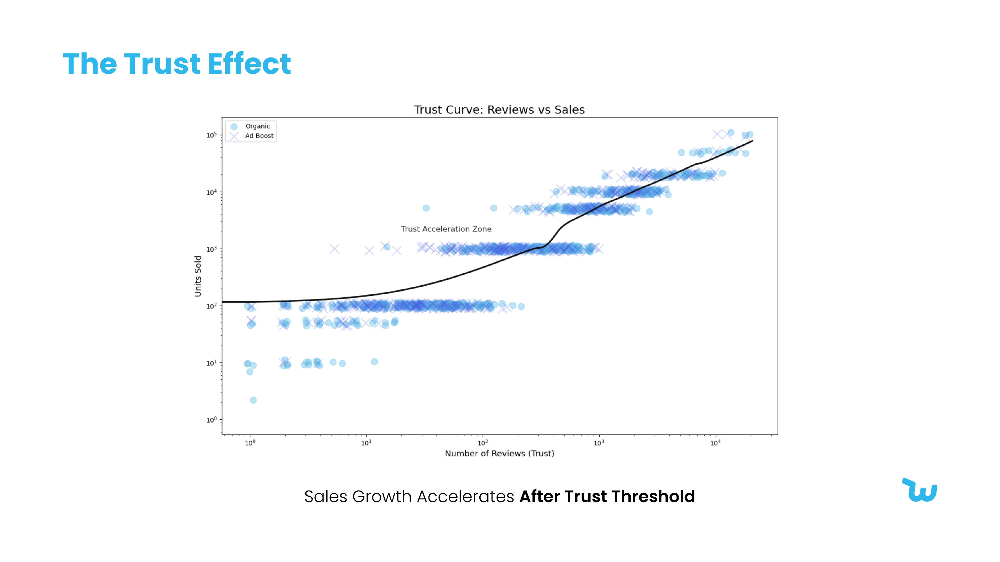

# Marketplace Product Performance — What Actually Drives Sales (Python)

In a marketplace with thousands of competing listings, only a small fraction succeed. This project asks the obvious commercial question — **what actually makes a product sell?** — and answers it with Python EDA over **1,573 listings across 43 variables**. The headline finding: **customer trust (review volume), not low price or paid ad boosts, is the strongest driver of sales.**

**Stack:** Python — pandas, NumPy, Matplotlib, Seaborn, Jupyter. Data cleaning, feature engineering, a custom **Sales Performance Index (SPI)**, correlation analysis, and an opportunity-landscape view.

---

## The finding in one minute

- **Trust beats price.** Review **count** has the strongest relationship with sales; average star rating alone barely correlates. Social proof — not being cheapest — is what converts.
- **Ads buy early visibility, not lasting success.** Ad boosts, urgency banners and badges help a product get *seen* at launch but don't consistently predict long-term performance.
- **Growth is a reinforcing loop:** reviews → trust → higher conversion → more sales → more reviews. The job is to seed that loop early.
- **Merchant credibility matters** — sellers with stronger reputations and more reviews sell more.
- **Positioning matters** — generic keywords keep a product visible; specific descriptors convert better.
- **There are underserved segments** (e.g. Plus-Size) where demand outstrips supply — and **early-viral products** (strong sales, few reviews yet) worth backing with visibility.

To compare products fairly across wildly different scales, I built a **Sales Performance Index (SPI)** from normalized sales, review and rating signals — so a holistic "is this product winning?" score replaces raw units sold.





Full written analysis: [`docs/analysis-report.pdf`](docs/analysis-report.pdf) · deck: [`docs/presentation.pdf`](docs/presentation.pdf). Also published on [Behance](https://www.behance.net/annakachkac).

---

## Strategic implications

1. **Seed reviews early** — help new products accumulate credible reviews fast to trigger the trust loop.
2. **Surface credible merchants** — reputation lifts conversion across the marketplace.
3. **Use ads for launch, not as a crutch** — promote for initial visibility, then let trust signals carry.
4. **Combine broad + specific keywords** — visibility *and* conversion.
5. **Expand underserved segments** — match supply to where demand already exists.

---

## How it was built

```
1  Inspect & clean — types, missing values, de-duplication; treat default 5-star/0-review as missing
2  Feature engineering — discount %, normalized signals, and the custom Sales Performance Index (SPI)
3  EDA — distributions (log-scaled for skew), sales long-tail, reviews-vs-sales, price-vs-sales
4  Correlation analysis — Pearson matrix + heatmaps to rank what relates to SPI / units sold
5  Opportunity landscape — trust × sales × price × category to spot underserved & early-viral products
```

---

## What's in this repo

```
marketplace-product-performance-python/
├── README.md                      ← this file
├── notebook/
│   └── analysis.ipynb             ← the full EDA: cleaning → SPI → correlation → opportunity view
├── docs/
│   ├── analysis-report.pdf        ← full written analysis & findings
│   ├── presentation.pdf           ← findings deck (charts)
│   └── dataset-description.pdf    ← dataset & variable description
└── images/
    └── slide-*.png                ← charts (heatmap, distributions, opportunity view)
```

> The dataset is a public marketplace "summer products" sample; the cleaning, the SPI metric, the analysis and the conclusions are my own.

---

## About

Part of my data-analytics portfolio. I look for the decision behind the data — here, that price wars and ad spend matter less than **earning trust**, which is exactly how I've built brands before.

🔗 [LinkedIn](https://www.linkedin.com/in/anna-kachkachishvili)
